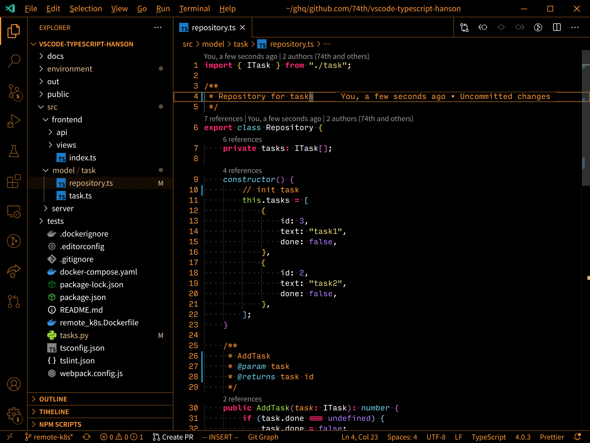
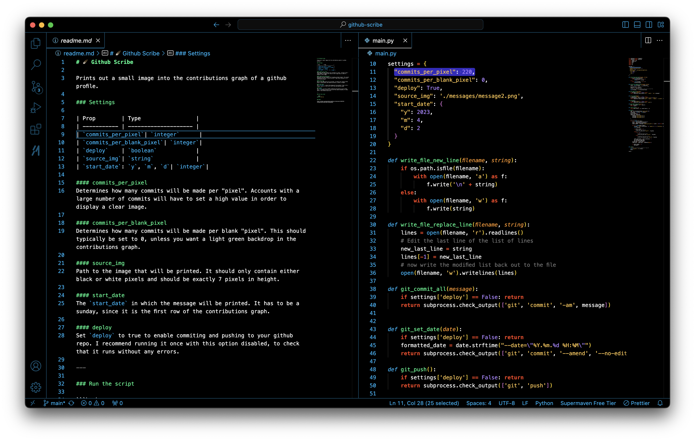
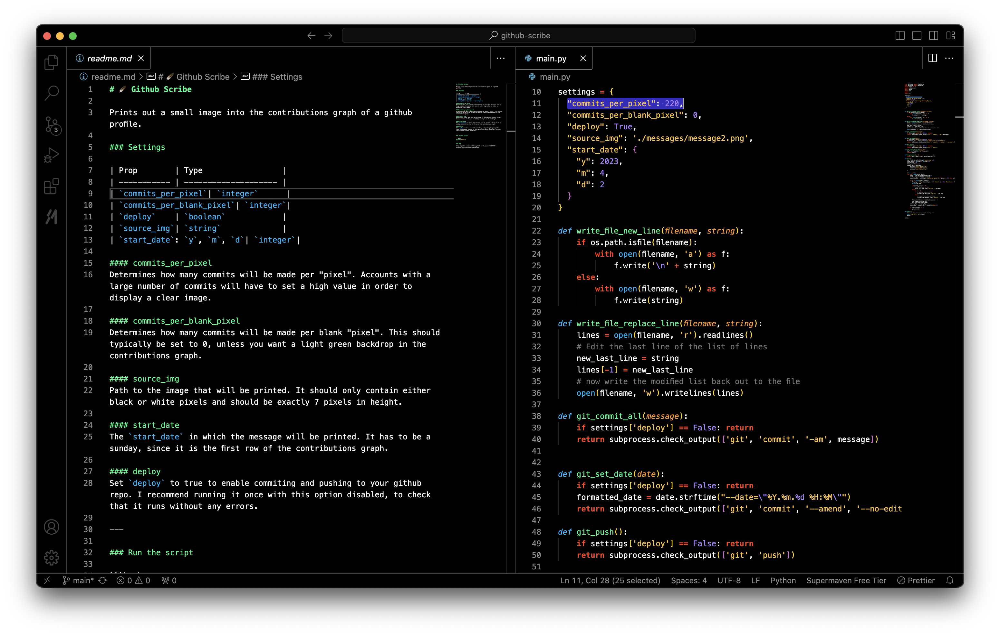
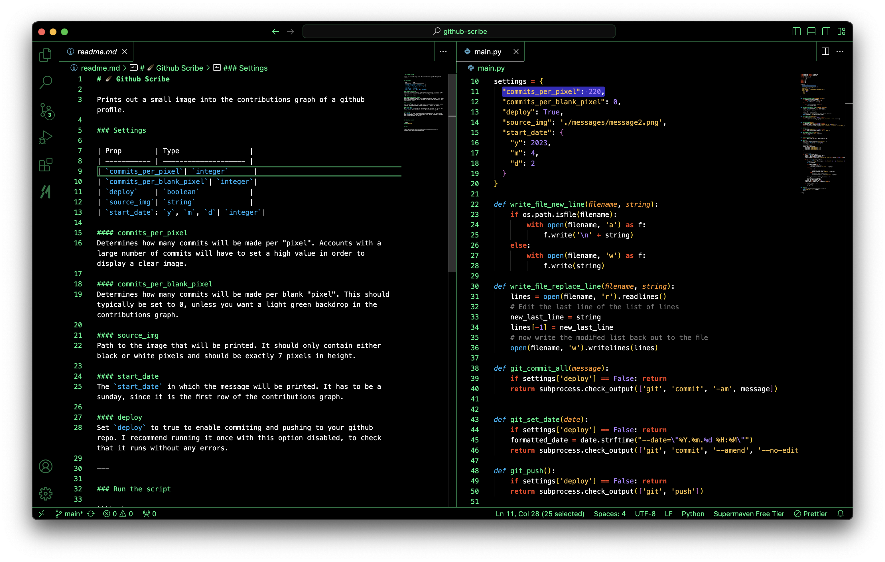
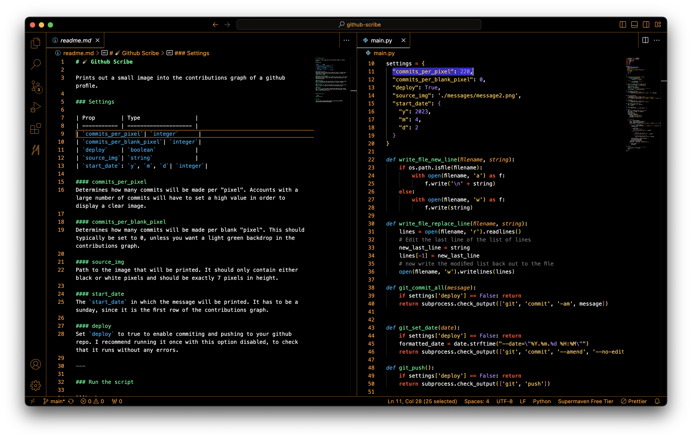
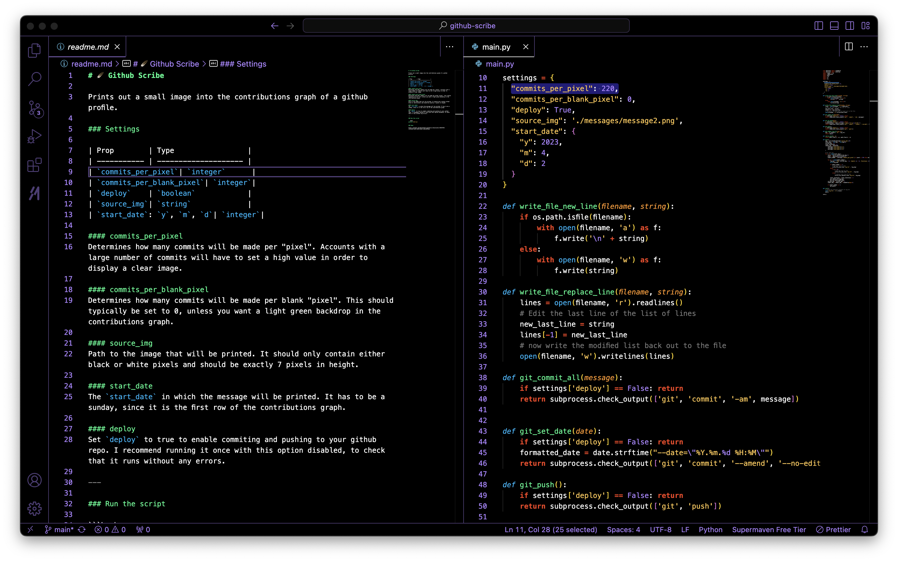
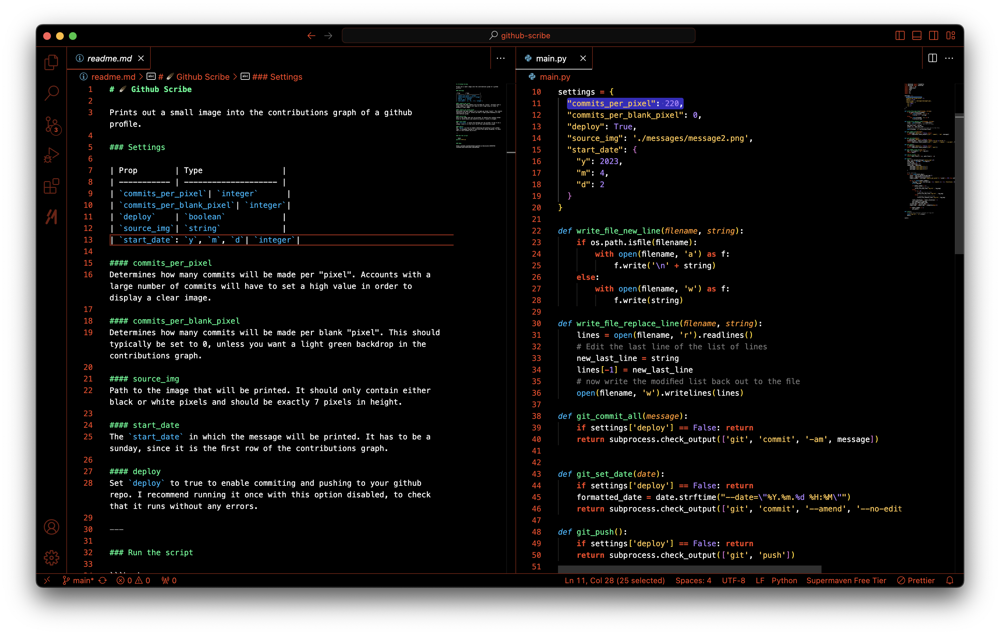
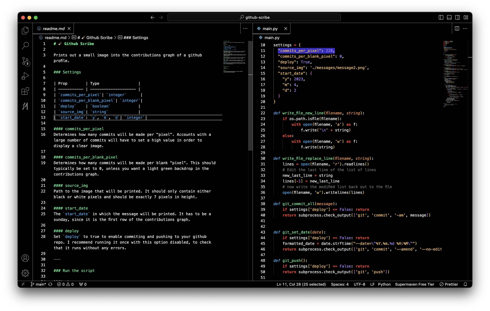
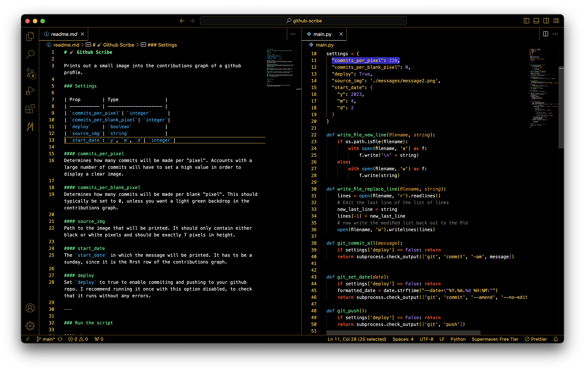

# 🧯 Ember High Contrast theme for vscode

- Based on [74th/vscode-monokaicharcoal](https://github.com/74th/vscode-monokaicharcoal)
- Revised colors



## Colors

### Blue



### Gray



### Green



### Orange



### Purple



### Red



### White



### Yellow



## For vim


## How to use

```
cd ~/.vscode/extensions/
git clone git@github.com:danielhdzzz/vscode-ember-high-contrast.git
```

restart VSCode and change the theme to ember-high-contrast(HC)

## To package the theme yourself

```bash
npm install -g @vscode/vsce
vsce package
```
