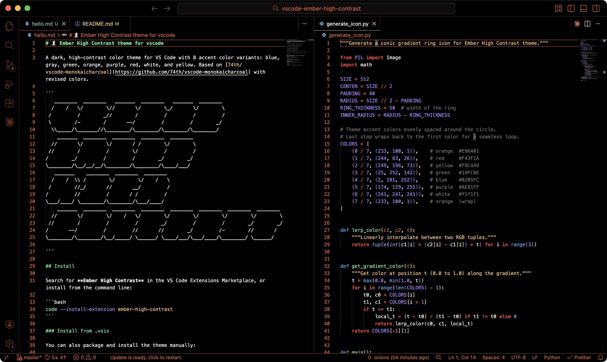
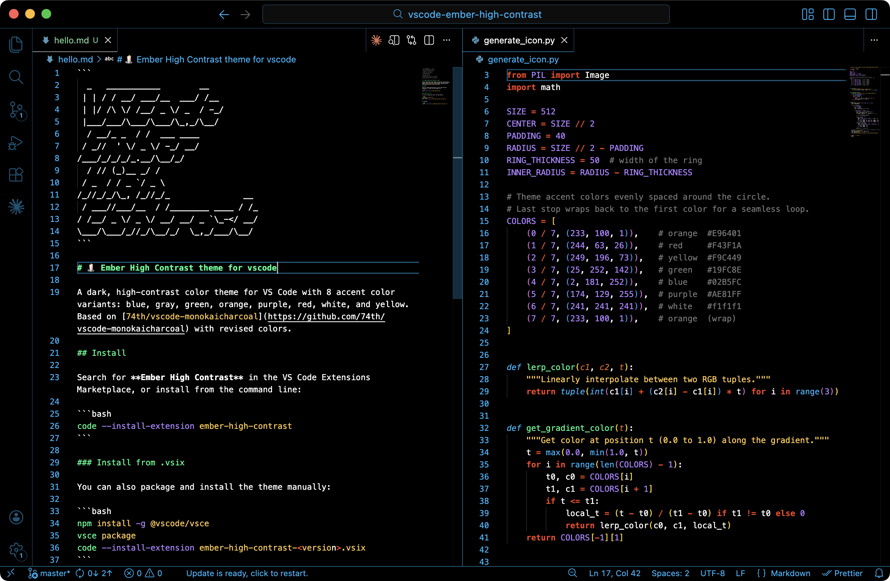
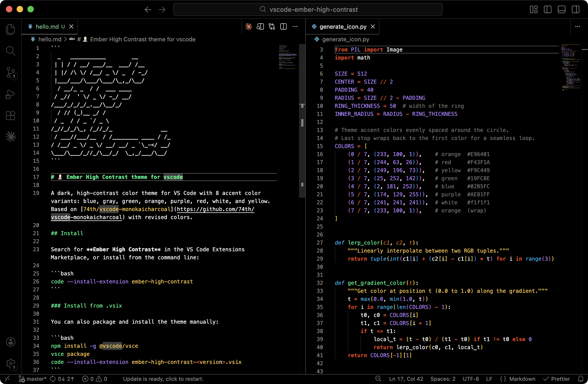
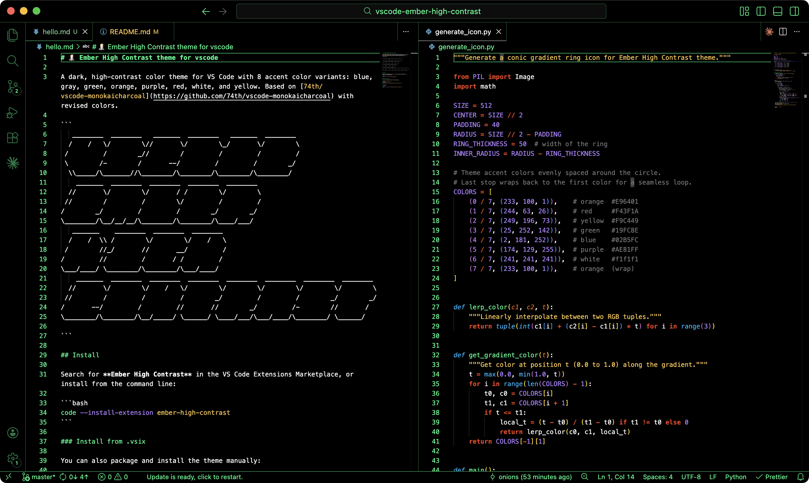
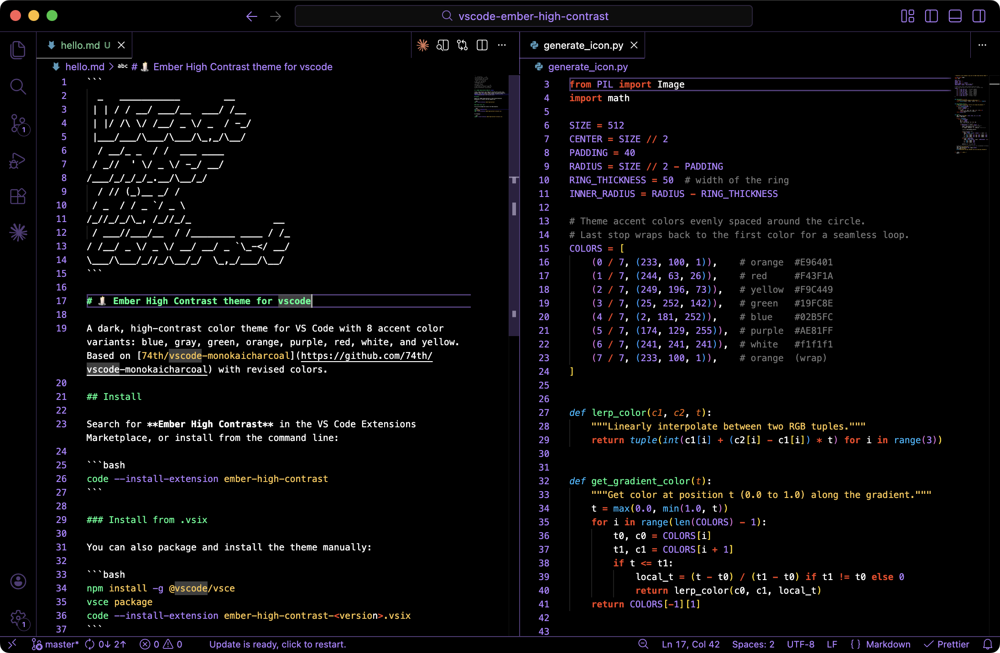
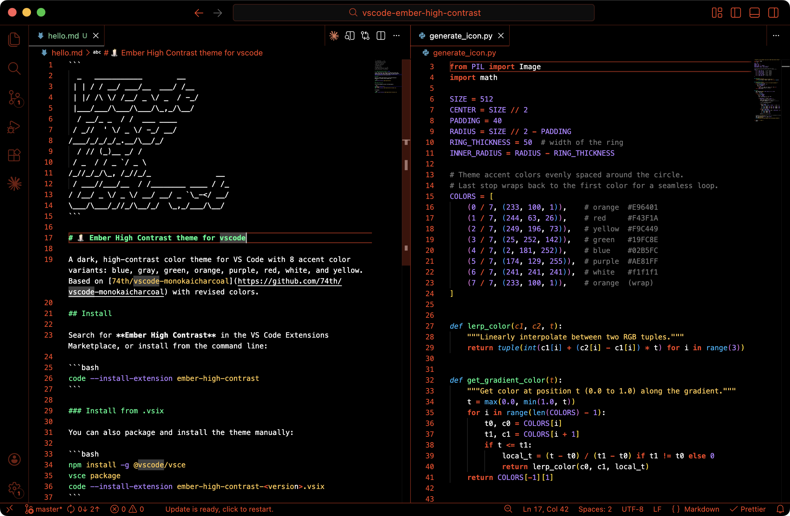
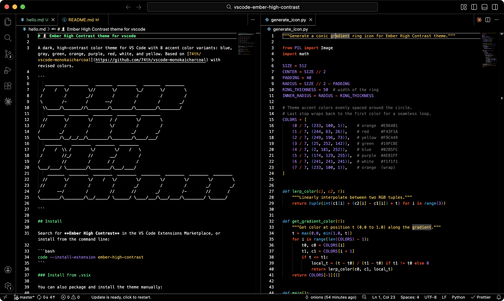
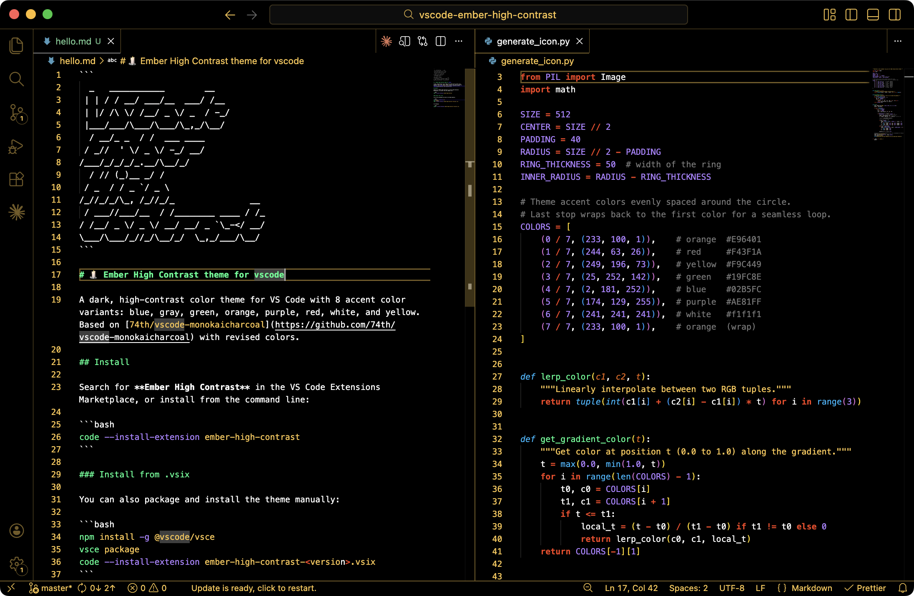

# 🕯️ Ember High Contrast theme for vscode

[](https://marketplace.visualstudio.com/items?itemName=danielhdzzz.ember-high-contrast)
[](https://open-vsx.org/extension/danielhdzzz/ember-high-contrast)

A dark, high-contrast color theme for VS Code with 8 accent color variants: blue, gray, green, orange, purple, red, white, and yellow. Based on [74th/vscode-monokaicharcoal](https://github.com/74th/vscode-monokaicharcoal) with revised colors, themed scrollbars, chat, warning/git colors and find match colors.



## Colors

### Blue



### Gray



### Green



### Orange


### Purple



### Red



### White



### Yellow



## Install

Search for **Ember High Contrast** in the VS Code Extensions Marketplace, or install from the command line:

```bash
code --install-extension danielhdzzz.ember-high-contrast
```

### Install from .vsix

You can also package and install the theme manually:

```bash
npm install -g @vscode/vsce
vsce package
code --install-extension ember-high-contrast-<version>.vsix
```

For VSCodium:

```bash
codium --install-extension ember-high-contrast-<version>.vsix
```

## Development

1. Open this folder in VS Code and press **F5** — a second window opens with the theme loaded live.
2. Edit `generate_themes.py` (palette, token colors, color template) and regenerate:
   ```bash
   python3 generate_themes.py
   ```
3. The dev host picks up color changes automatically. If it doesn't, run **Developer: Reload Window** (`Cmd+Shift+P`).

No packaging or installing needed — just edit and see. Do not edit the theme JSON files by hand.
